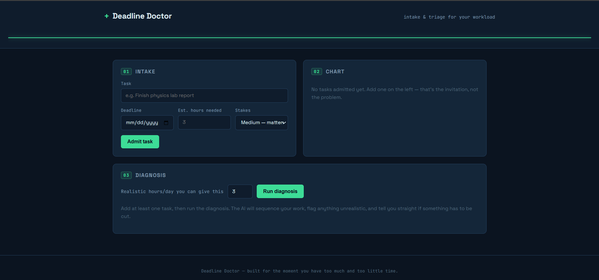
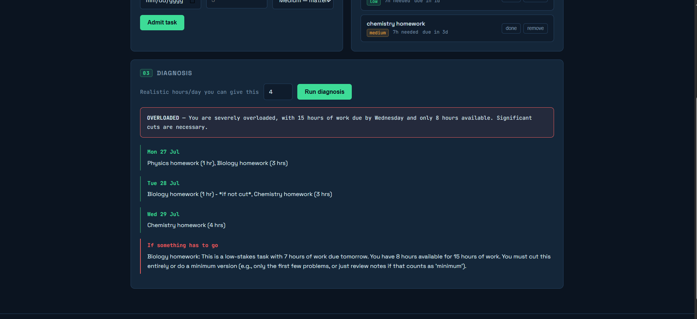

# Deadline Doctor

**Triage your workload when you have too much to do and too little time to do it.**

## a. The problem, and who it's for

Every student (and most working people) hits the same moment: three or four things are due around the same time, you don't actually know if it's all *possible* in the time you have, and the panic itself burns time you don't have. Calendars and to-do lists show you *what's* due — they don't tell you whether your plan is realistic, what order to attack things in, or what to cut if it isn't.

Deadline Doctor is a small triage tool for exactly that moment. You "admit" your pending tasks like patients — title, deadline, estimated hours, and how much is riding on it — and it gives you an honest diagnosis: a day-by-day plan, and if you've genuinely got too much on your plate, it tells you straight what to cut or shrink instead of pretending everything fits.

**Built for:** students juggling assignments/exams, but works for anyone with a pile of deadlines and limited hours per day.

## b. Live URL

🔗 **[PASTE YOUR DEPLOYED VERCEL URL HERE]**

## c. Features

- **Admit tasks** — title, deadline, estimated hours required, and a stakes level (low / medium / high).
- **Chart view** — all open tasks sorted automatically by urgency, with days-remaining shown live, and a mark-done / remove action per task.
- **Persistent storage** — tasks are saved in the browser (`localStorage`), so your list survives a refresh or closing the tab. No account or database needed.
- **Live "pulse line"** — a vitals-monitor-style line in the header that visually spikes the more overloaded your current workload is (calculated from hours-needed vs. days-remaining across all open tasks), turning from green → amber → red.
- **AI diagnosis** — the core feature (below): a one-click, AI-generated day-by-day rescue plan with an honest overloaded/manageable verdict.
- Fully responsive layout; keyboard-focus visible on all interactive elements; respects reduced-motion preference.

## d. The AI feature

**What it does:** you set how many hours/day you can realistically give your work right now, click **"Run diagnosis,"** and the app sends your current task list to Claude (Anthropic's API) via a serverless backend. Claude:

1. Builds a concrete day-by-day plan of what to work on and roughly how long, weighing both urgency (days left) and stakes (a high-stakes task isn't left to the last minute just because its deadline is further out).
2. Gives a plain verdict — `ok` or `overloaded` — based on whether the hours actually fit before each deadline.
3. If overloaded, names specific tasks to cut, delay, request an extension on, or do a reduced "minimum version" of — and explains why those and not others.

This is the actual value of the app: not just organizing tasks, but giving a *judgment call* a tired, panicking person doesn't have the distance to make about their own workload.

**The exact system prompt used** (in [`api/plan.js`](./api/plan.js)):

```
You are "Deadline Doctor," an admissions-triage assistant for an overloaded student or worker.

You will receive JSON describing:
- today's date
- how many hours per day the person can realistically work
- a list of tasks, each with a title, a deadline, estimated hours needed, and a stakes level (low/medium/high)

Your job:
1. Work out, day by day between today and the furthest deadline, which task(s) the person should work on and for roughly how long. Prioritize by urgency (days remaining) AND stakes (high-stakes tasks should not be crammed last-minute even if not the soonest deadline). Be specific and directive — say what to do, not just what exists.
2. Decide a verdict: "ok" if the total estimated hours fit inside the available daily hours before each deadline, "overloaded" if they clearly do not.
3. If overloaded, say plainly in "cuts" which task(s) are the best candidates to cut, delay, ask for an extension on, or do a reduced/minimum version of — and briefly why those and not others. Prefer cutting low-stakes work over high-stakes work. Never suggest cutting something without saying what a "minimum version" would look like if one is possible.
4. Be honest and direct, like a doctor giving a real diagnosis — not falsely reassuring. If the plan is tight but possible, say so plainly. If it is not possible, say so plainly and explain why (e.g. "you have 14 hours of work and 6 available hours before Tuesday").
5. Keep total output concise: a one-sentence summary, 3-7 day entries (group days if the plan is long — e.g. "Mon-Tue" is a valid label), and cuts only if verdict is "overloaded".

Respond with ONLY valid JSON, no markdown fences, no commentary outside the JSON, matching exactly this shape:
{
  "verdict": "ok" | "overloaded",
  "summary": "one sentence, plain language",
  "days": [ { "label": "Mon 28 Jul", "plan": "what to do this day, specific and short" } ],
  "cuts": ["short actionable suggestion", ...]
}
```

**Model used:** `claude-sonnet-4-6` via the Anthropic Messages API (`https://api.anthropic.com/v1/messages`), called server-side from a Vercel serverless function so the API key is never exposed to the browser.

## e. Tools, services, and models used

- **Frontend:** plain HTML / CSS / vanilla JavaScript — no framework, so the whole app loads instantly with zero build step.
- **Backend:** a single Vercel serverless function (`api/plan.js`, Node.js runtime).
- **AI model:** Claude (`claude-sonnet-4-6`) via the Anthropic API.
- **Storage:** browser `localStorage` (no database — deliberately kept simple for a single-user tool).
- **Hosting:** Vercel (free tier).
- **Built with the help of:** Claude (Anthropic), used as a coding assistant to write and review this codebase.

## f. Screenshots

> **[ADD AT LEAST 3 SCREENSHOTS HERE after you deploy — see checklist below]**
> Suggested shots:
> 1. Empty state / intake form
> 2. Chart view with a few tasks admitted, showing the pulse line
> 3. A completed AI diagnosis with a day-by-day plan
> 4. (bonus) an "overloaded" verdict showing the cuts section

```markdown



```

## g. How to run this project

### Run locally
```bash
git clone https://github.com/YOUR-USERNAME/deadline-doctor.git
cd deadline-doctor
cp .env.example .env.local
# edit .env.local and paste your real Anthropic API key
npm install -g vercel   # if you don't already have the Vercel CLI
vercel dev              # serves the frontend AND the /api/plan function locally
```
Then open the local URL it prints (usually `http://localhost:3000`).

### Deploy to Vercel (what was used for the live URL above)
1. Push this repo to your own public GitHub repository.
2. Go to [vercel.com](https://vercel.com) → **New Project** → import your GitHub repo.
3. In **Project Settings → Environment Variables**, add:
   - `ANTHROPIC_API_KEY` = *your Anthropic API key* (get one at [console.anthropic.com](https://console.anthropic.com))
4. Deploy. Vercel automatically detects `api/plan.js` as a serverless function — no extra config needed.
5. Open the live URL Vercel gives you, and paste it into section (b) above.

No database, no signup flow, no extra services required.

---

*Built as a final project — an original tool made to solve a real, personally-felt problem: knowing whether an overloaded schedule is actually survivable, and what to cut if it isn't.*
